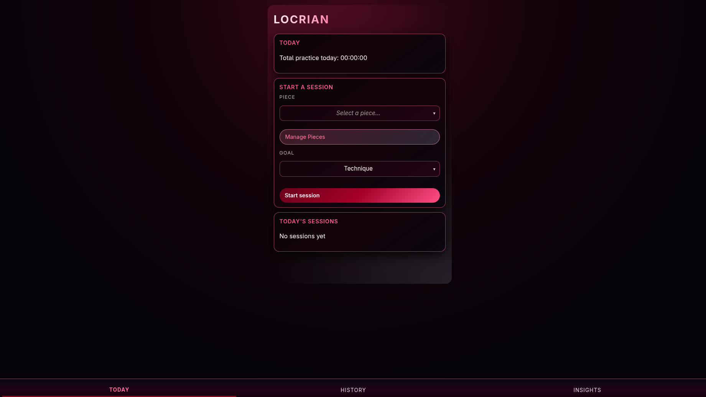
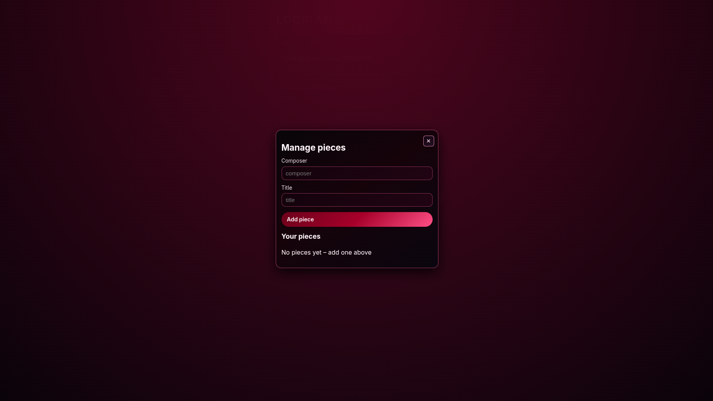
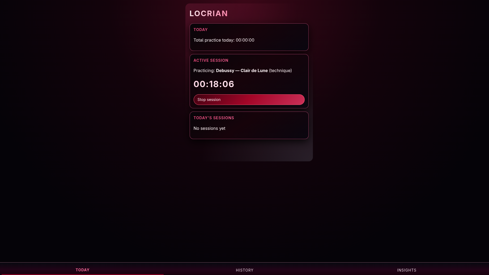
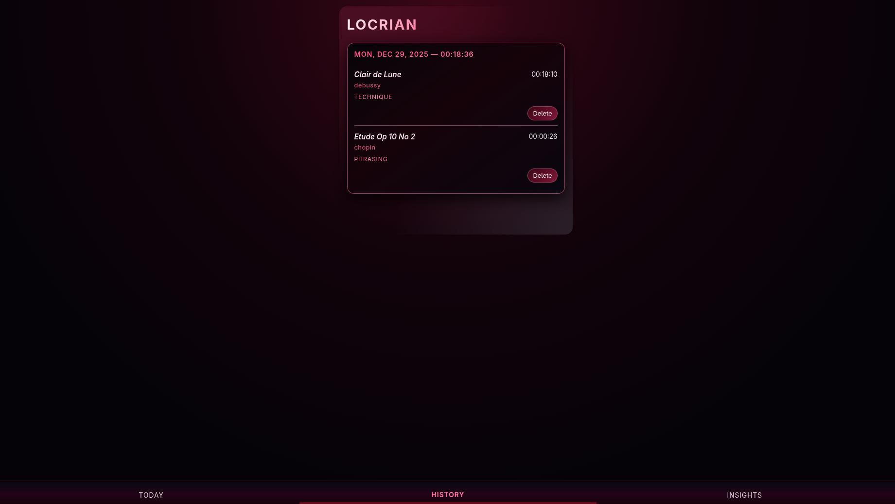
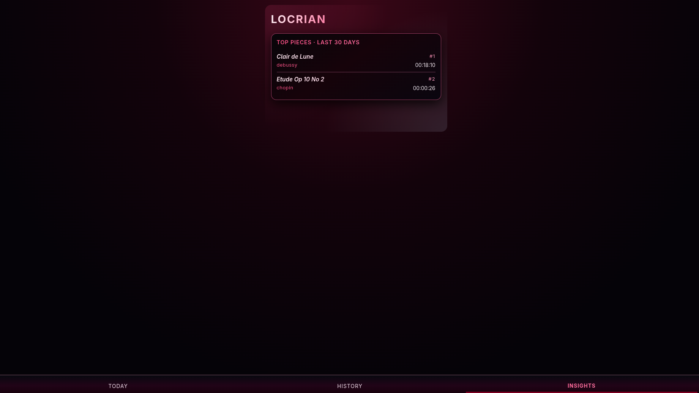

# Locrian

Locrian is a music practice app built to help musicians track their practice sessions. It has the core features of session logging, timers, and insights.

## Features

- Practice Stopwatch
- Session Logging
- Goal management 
- Piece Manager
- Insights

## Screenshots

### Homepage 

### Piece Manager  

### Practice Timer  

### History  

### Insights  

## Who Locrian Is For

Locrian is for musicians who want a calm, professional-feeling way to track practice.

## Project Status

This project is currently heavily in development. Expect more features and qualify of life changes in the future.
